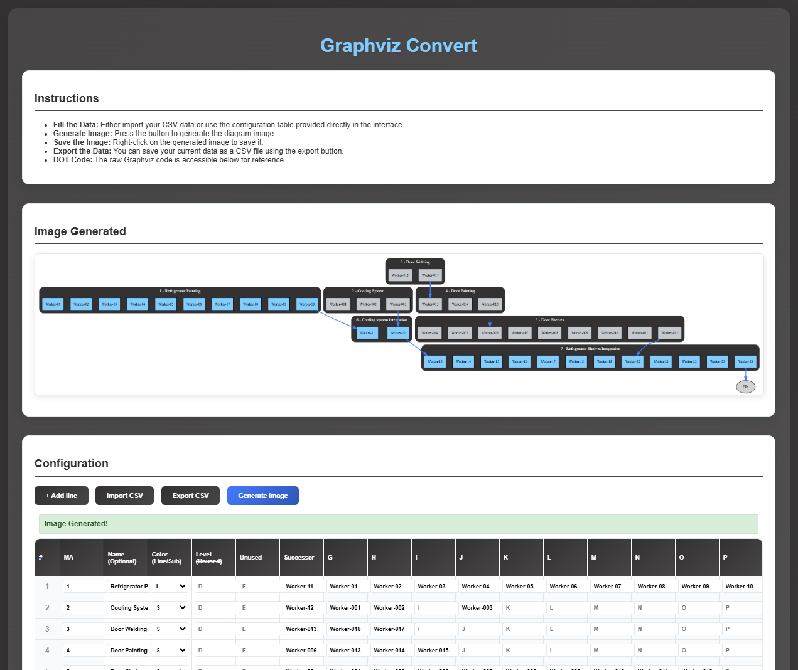

# 🛠️ graphviz_convert

**Convert a CSV file into a Graphviz visualization aligned for manufacturing processes.**

---

## 📂 Project Description

This tool takes a structured CSV file as input and generates a `.dot` file for use with [Graphviz](https://graphviz.org/), visualizing manufacturing process flows.

---

## 📥 Input Format

CSV file with the following columns:

